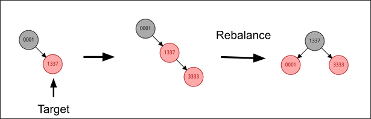

+++
date = '2026-02-15T12:00:00-00:00'
title = 'n-day exploit of CVE-2026-23014'
description = "Linux kernel exploitation of CVE-2026-23014"
keywords = ["kernel", "exploitation"]
tags = ["kernel", "exploitation"]
summary = "writeup for the exploitation of CVE-2026-23014"
+++

# Preamble
A little less than 2 months ago, I found what was, at the time, a 0-day vulnerability in the Linux kernel. I decided it was too recent a bug to get any money from exploiting and ended up reporting it to the Linux kernel developers. After getting ignored by the Linux kernel developers for a month, I decided to try and exploit it, only to realize it had been patched a few weeks after my initial bug report.

Nonetheless, I thought it would be a fun exercise to exploit it and achieve LPE with an n-day exploit. I am exploiting against v6.18.5 with KernelCTF's [COS config](https://cos.googlesource.com/third_party/kernel/+/refs/heads/cos-6.12/arch/x86/configs/lakitu_defconfig).

This bug is patched in all active kernel branches and never even reached most Linux distros with the main exception being rolling distros like Arch.

# The Bug
The bug in question is CVE-2026-23014. The [patch commit message](https://git.kernel.org/pub/scm/linux/kernel/git/stable/linux.git/commit/?id=deee9dfb111ab00f9dfd46c0c7e36656b80f5235) incorrectly details the root cause and introducing commit but fortunately/unfortunately, correctly patches the bug.

This bug exists in the performance event subsystem in `perf_swevent_cancel_hrtimer()`:

```c
/*
 * Careful: this function can be triggered in the hrtimer handler,
 * for cpu-clock events, so hrtimer_cancel() would cause a
 * deadlock.
 *
 * So use hrtimer_try_to_cancel() to try to stop the hrtimer,
 * and the cpu-clock handler also sets the PERF_HES_STOPPED flag,
 * which guarantees that perf_swevent_hrtimer() will stop the
 * hrtimer once it sees the PERF_HES_STOPPED flag.
 */
if (is_sampling_event(event) && (hwc->interrupts != MAX_INTERRUPTS)) {
    ...
    hrtimer_try_to_cancel(&hwc->hrtimer);
}
```

The check `hwc->interrupts != MAX_INTERRUPTS` prevents the high resolution timer (`hrtimer`), used for periodic sampling of certain software events, from being directly canceled when the software event is throttled. This was originally added to prevent a deadlock when trying to cancel an hrtimer within its own handler. Instead, throttled events should rely on the `PERF_HES_STOPPED` flag to trigger `HRTIMER_NORESTART` in `perf_swevent_hrtimer()`, preventing the hrtimer from being requeued. Since an hrtimer is dequeued when its handler function is running, this is an effective solution.

The problem arises when our hrtimer is throttled while active. This is possible through the performance event grouping mechanism, which allows for many features including shared scheduling. This means if one event in a group is throttled, all events are throttled via `perf_event_throttle_group()`. As a result, the timer can now remain in the queue after `perf_swevent_cancel_hrtimer()`.

This would likely not be a vulnerability, except `perf_swevent_cancel_hrtimer()` is part of the call-chain to dequeue (cancel) the hrtimer on software event destruction:

```
...
-> __perf_remove_from_context()
    -> event_sched_out()
        -> cpu_clock_event_del()
            -> cpu_clock_event_stop()
                -> perf_swevent_cancel_hrtimer()
``` 

All of a sudden, we have a potential UAF.

## Theory -> PoC
If we manage to throttle our target software event, we can then free the event, while the hrtimer remains in the queue. Since `hrtimer` is a  sub-struct of `perf_event`, the hrtimer reference in the timer queue points back to our now freed `perf_event`!

To turn theory into reality, we create an events group with our target software event and a throttling event. Our target software event must use an hrtimer, so I opted to use `PERF_COUNT_SW_CPU_CLOCK`. The hrtimer length must also be set long enough so that it does not expire and dequeue before the UAF happens. I set this value to 30 seconds, which can be controlled by setting the `sample_period` of the software event in nanoseconds.

For the throttling event, we use `PERF_COUNT_HW_CPU_CYCLES` with a `sample_period` of `1`. However, this does not immediately throttle our group. To throttle, the number of interrupts since the last tick must be greater than or equal to `max_samples_per_tick`, a global variable calculated using `sysctl_perf_event_sample_rate`:

```
static int
__perf_event_account_interrupt(struct perf_event *event, int throttle)
{
	struct hw_perf_event *hwc = &event->hw;    
    ...

	if (unlikely(throttle && hwc->interrupts >= max_samples_per_tick)) {
		...
        perf_event_throttle_group(event);
    	...
    }

```

I found that I needed `max_samples_per_tick <= 10000` for reliable throttling. If we want to directly set this value, we must be root and write to `/proc/sys/kernel/perf_event_max_sample_rate`.

Good news - this value can be lowered in `perf_sample_event_took()` if the average perf event nmi handler length is too high. Don't worry, the rabbit-hole doesn't go too deep. Increasing the average nmi handler length is as simple as having a lot of perf event sampling, i.e. spam multiple throttling events as part of the exploit setup.

We see this message buffer output as a result:

```
perf: interrupt took too long (2587 > 2500), lowering kernel.perf_event_max_sample_rate to 77000
perf: interrupt took too long (3251 > 3233), lowering kernel.perf_event_max_sample_rate to 61000
perf: interrupt took too long (4255 > 4063), lowering kernel.perf_event_max_sample_rate to 47000
perf: interrupt took too long (5362 > 5318), lowering kernel.perf_event_max_sample_rate to 37000
perf: interrupt took too long (6721 > 6702), lowering kernel.perf_event_max_sample_rate to 29000
perf: interrupt took too long (8483 > 8401), lowering kernel.perf_event_max_sample_rate to 23000
perf: interrupt took too long (10637 > 10603), lowering kernel.perf_event_max_sample_rate to 18000
perf: interrupt took too long (13426 > 13296), lowering kernel.perf_event_max_sample_rate to 14000
perf: interrupt took too long (16787 > 16782), lowering kernel.perf_event_max_sample_rate to 11000
perf: interrupt took too long (20990 > 20983), lowering kernel.perf_event_max_sample_rate to 9000
```

## Unprivileged Access
The performance subsystem has different levels of unprivileged access according to `perf_event_paranoid`. From the [kernel developers](https://www.kernel.org/doc/Documentation/sysctl/kernel.txt):

```
Controls use of the performance events system by unprivileged
users (without CAP_SYS_ADMIN).  The default value is 2.

 -1: Allow use of (almost) all events by all users
     Ignore mlock limit after perf_event_mlock_kb without CAP_IPC_LOCK
>=0: Disallow ftrace function tracepoint by users without CAP_SYS_ADMIN
     Disallow raw tracepoint access by users without CAP_SYS_ADMIN
>=1: Disallow CPU event access by users without CAP_SYS_ADMIN
>=2: Disallow kernel profiling by users without CAP_SYS_ADMIN
```

Debian, Ubuntu, and Android kernels introduce another security level `PERF_SECURITY_TRACEPOINT = 3`, and Ubuntu introduces `PERF_SECURITY_MAX = 4` as the default, preventing any unprivileged performance events :\

Ubuntu source:

```c
#define PERF_SECURITY_OPEN		    0

/* Finer grained perf_event_open(2) access control. */
#define PERF_SECURITY_CPU	        1
#define PERF_SECURITY_KERNEL		2
#define PERF_SECURITY_TRACEPOINT	3
#define PERF_SECURITY_MAX		    4

static inline bool perf_paranoid_any(void)
{
	return sysctl_perf_event_paranoid >= PERF_SECURITY_MAX;
}
```

This means our bug is not triggerable from unprivileged users on Ubuntu but should work for other default distros. We just have to include `.exclude_kernel = 1` and only track the current process when creating our performance events. There is also `.exclude_hv` for hypervisor events, but this does not apply to the chosen events.

# Exploit Time
We got an unprivileged UAF! Now what?

Well, first, we should probably understand what an `hrtimer` even is and how it fits into our `perf_event`. `perf_event` is a large struct, but importantly it contains: `struct hw_perf_event hw`, which internally contains `struct hrtimer hrtimer`:

```c
struct hrtimer {
	struct timerqueue_node		node;
	ktime_t				_softexpires;
	enum hrtimer_restart		(*__private function)(struct hrtimer *);
	struct hrtimer_clock_base	*base;
	u8				state;
	u8				is_rel;
	u8				is_soft;
	u8				is_hard;
};
```

Great news! We have a function pointer in our struct. This means if we can control its contents, we can almost certainly get PC control and win. We will delve MUCH deeper into the hrtimer rabbit-hole in a bit, but for now, this is all we need to know about them.

## Cross-cache
Since `perf_event` has its own SLUB cache, I opted to use the cross-cache technique to overlap a `struct msg_msg` to control the data. This [article](https://ruia-ruia.github.io/2022/08/05/CVE-2022-29582-io-uring) does a great job explaining the underlying mechanics, but I opted for the simpler spray and pray method described [here](https://kaligulaarmblessed.github.io/post/cross-cache-for-lazy-people/).

As a quick note, from here on out, the exploit code is pinned to the same CPU core since many kernel mechanisms have per-cpu components.

The only question we need to answer is what size should our message be? As mentioned in the first linked article, the buddy allocator does not treat all pages the same. It distinguishes between the order of pages, where higher order pages represent larger continuous regions of memory. For simplicity, we should choose a message size such that the `struct msg_msg` cache has the same page order as the `perf_event` cache. Using `/proc/slabinfo`, we want the `pagesperslab` to match:

```
# name            <active_objs> <num_objs> <objsize> <objperslab> <pagesperslab>
perf_event            12     12   1344   12    4
msg_msg-1k             0      0   1024   16    4
```

Since `CONFIG_SLAB_BUCKETS` is enabled, `msg_msg` has its own cache - another reason cross-cache is so great. Although, it should be noted that on the kernelctf mitigation instance, cross-cache is thwarted by `SLAB_VIRTUAL`.

We see the value is 4 pages per slab for `perf_event`, and the matching `msg_msg` cache corresponds to a size of 1024. Since there is an overhead of 48, I allocate a msg of size 976.

The final step before we get arbitrary control of the hrtimer data is to determine how `hrtimer` and `msg_msg` overlap to calculate offsets. Normally, this is pretty trivial, but `perf_event` goes across page boundaries, so depending on which object we get from the slab freelist (`CONFIG_SLAB_FREELIST_RANDOM`), the offset of `hrtimer` from the beginning of `msg_msg` can vary:


Fortunately, these regions are non-intersecting, so we can craft a `msg_msg` such that it writes the same content to `hrtimer` no matter which `perf_event` we get from the slab freelist. The one caveat is that one `hrtimer` region (0x3e8 - 0x28) wraps around `msg_msg`. Since there is a 48 overhead, I opted to just take the loss and call 11 out of 12 good enough.

However, even this is likely solvable. If we use `msg_msgseg`, there is only an 8 byte overhead, which would only corrupt the `timerqueue_node` `expires` field. As will become clearer later, this is not the end of the world. The exploit should still work with potential timing issues, but for simplicity and proof of exploit, I will ignore this edge case.

## hrtimer = win?
Arbitrary `hrtimer` data achieved! With the function pointer, a win should be trivial right?

Kinda.

We still never discussed how this function pointer is used. As a reminder:

```c
struct hrtimer {
	struct timerqueue_node		node;
	ktime_t				_softexpires;
	enum hrtimer_restart		(*__private function)(struct hrtimer *);
	struct hrtimer_clock_base	*base;
	u8				state;
	u8				is_rel;
	u8				is_soft;
	u8				is_hard;
};

struct timerqueue_node {
	struct rb_node node;
	ktime_t expires;
};


struct rb_node {
	unsigned long  __rb_parent_color;
	struct rb_node *rb_right;
	struct rb_node *rb_left;
};
```

The hrtimer system works on a per-cpu basis (pointed to by `base`), where each cpu has a timerqueue holding its hrtimers. This `timerqueue` is just a red-black tree (rb-tree) ordered by the `expires` time in each node. During `hrtimer_interrupt()`, called as part of the timer interrupt, nodes are dequeued if their `_softexpires` expiration time is before or equal to the current time in nanoseconds:

```c
static void __hrtimer_run_queues(struct hrtimer_cpu_base *cpu_base, ktime_t now,
				 unsigned long flags, unsigned int active_mask)
{
    ...

    while ((node = timerqueue_getnext(&base->active))) {
        struct hrtimer * timer;
        
        ...

        if (basenow < hrtimer_get_softexpires_tv64(timer))
            break;

        __run_hrtimer(cpu_base, base, timer, &basenow, flags);

        ...
}
```

When dequeued, the callback function stored in `timer->function` is called via `__run_hrtimer()`. Therefore, we need to maintain a "valid" hrtimer so that it can remain in the timerqueue and be properly dequeued.

Initially, I just set `expires` = `_softexpire` = current time + 10 seconds, the `u8` fields to the same value in the original struct, `function` to 0x1337, and the pointers to NULL. My hope was to get a kernel page fault on 0x1337 to confirm PC control. However, I immediately ran into NULL-ptr dereference panics in `timerqueue_add()` and `timerqueue_del()`.

## RB-Tree Feng Shui
In this section, I will discuss how to resolve these kernel panics by manipulating our target node and the rb-tree. I will try to explain the relevant rb-tree algorithms, but you should be familiar with the [basic algorithms and invariants of rb-trees](https://www.geeksforgeeks.org/dsa/introduction-to-red-black-tree/).

At first, I was confused because all the NULL pointers should be valid. `base` will not be used unless our CPU dies and child and parent pointers can be NULL in an rb-tree. NULL child pointers indicate a leaf node, and a NULL parent pointer indicates the root of the tree. However, for efficiency, many rb-tree algorithms can make assumptions about the existence of children and parent nodes without doing a NULL check.

To fix this, I created a method to make the parent pointer valid:

1. Create a timer with a slightly smaller expiration time than the target node. We will call this new timer the predecessor.
2. Insert the target node.
3. Remove the predecessor.

The rb-tree removal algorithm will set the target's parent pointer while never using the invalid one. This works because binary search tree (BST) removal replaces the deleted node with its successor and conveniently searches down the rb-tree to find the successor. This means that efficient rb-tree implementations, such as the Linux kernel, will not access the successor's parent pointer when updating the tree. Instead, the parent is remembered from the initial tree traversal.

```
static __always_inline struct rb_node *
__rb_erase_augmented(struct rb_node *node, struct rb_root *root,
		     const struct rb_augment_callbacks *augment)
{
struct rb_node *child = node->rb_right;
struct rb_node *tmp = node->rb_left;
struct rb_node *parent, *rebalance;
unsigned long pc;

...

struct rb_node *successor = child, *child2;

tmp = child->rb_left;
...
/*
 * Case 3: node's successor is leftmost under
 * node's right child subtree
 *
 *    (n)          (s)
 *    / \          / \
 *  (x) (y)  ->  (x) (y)
 *      /            /
 *    (p)          (p)
 *    /            /
 *  (s)          (c)
 *    \
 *    (c)
 */
do {
    parent = successor;
    successor = tmp;
    tmp = tmp->rb_left;
} while (tmp);
child2 = successor->rb_right;
WRITE_ONCE(parent->rb_left, child2);
```

This change improved stability, but there were still panics in the rb-tree insertion and removal algorithms. These panics mostly occurred because the parent pointer (`__rb_parent_color`) had not been fixed yet or the child pointers were NULL.

### Observe, Then Strike 
On insertion, if our target node becomes the parent of the now inserted node, the tree can undergo a rebalancing. This only happens when the parent node is red because if the parent node is black, no rb-tree properties are violated on insertion.



Made with the [RedBlack Visualizer](https://www.cs.usfca.edu/~galles/visualization/RedBlack.html)

When rebalancing, the insertion algorithm picks between one of two cases depending on whether or not the uncle of the inserted node is red or black. In either case, to check the color of the uncle, we must navigate to the grandparent (parent of our target node). Due to the root-is-black invariant of rb-trees, the grandparent must exist, meaning no NULL check is performed:

```
static __always_inline void
__rb_insert(struct rb_node *node, struct rb_root *root,
	    void (*augment_rotate)(struct rb_node *old, struct rb_node *new))
{
        ...
        /*
		 * If there is a black parent, we are done.
		 * Otherwise, take some corrective action as,
		 * per 4), we don't want a red root or two
		 * consecutive red nodes.
		 */
		if(rb_is_black(parent))
			break;

		gparent = rb_red_parent(parent);

		tmp = gparent->rb_right;
```

This of course leads to a NULL-ptr dereference when the parent pointer is still corrupted. To fix this, we can simply make our target node black.

On deletion, the BST deletion algorithm swaps the deleted node with its successor, as discussed earlier. When the successor is a black node, the sibling is checked. If our target node is the parent of the successor, checking the siblings will dereference our NULL child pointers - kernel panic!

There is no NULL child check because the invariant that requires all node-to-leaf paths have the same number of black nodes ensures a black leaf node must have a sibling node. To fix (or at least remedy) this issue, we should make our target node black. The idea is that a red node must have a black child node, so having a black target node allows for the possibility of a red child node, avoiding the NULL-ptr deref.

Let's go! I was starting to get worried that the insertion vs deletion investigations would give conflicting results on what color our target node should be. Nonetheless, there still exists a window between the UAF and successful control of the hrtimer data where the NULL-ptr deref can happen, assuming the cross-cache ever succeeds.

Deeper rb-tree issues can also arise if the initial node corruption propagates into more invariant violations. There is certainly room for improvement, but overall, we have significantly limited the kernel panic issue.

### Failed Experimenting
As mentioned, we did not outright solve our rb-tree corruption but rather reduced the chance a panic happens. To help prevent further rb-tree corruption, I experimented with isolating the target node from the uncontrolled rb-tree. I had two ideas:

1. Make the target and predecessor very large (10+ minutes). This moves them to the right most side of the rb-tree, hopefully isolating the nodes. One major drawback of this approach is that our timer is now really long, and we have created a cool, but slow ticking time bomb of an exploit.
2. Insert many timers of the same length, hopefully isolating the target timer from the noise of the timerqueue.

**Case 1:** I found this technique did not significantly change the stability. I think it failed because despite being the right most node, our target node can still have child nodes, so there is little real isolation. Also, the predecessor can even become the target node's child, so when the predecessor is freed, the kernel can panic.

**Case 2:** Again, this technique was not effective. The problem is rb-tree rebalancing is hard to predict without knowing the exact tree layout. As a result, spamming new nodes does not necessarily separate the target node from the uncontrolled nodes in the tree. I even tried combining case 1 and 2, but this failed likely for the same reasons. 

For my final exploit, I chose to keep it simple and not use these isolation techniques since I found little benefit and could already achieve ~50% stability.

I would be curious if there are better techniques to significantly improve the reliability of the exploit. I wanted to avoid heap leaks, but if heap leaks are possible without introducing more instability, maybe crafting fake nodes could work.

## KASLR Is Dead
I just used a prefetch side-channel attack to leak the kernel base. I mostly copied the code from this [writeup](https://github.com/google/security-research/blob/master/pocs/linux/kernelctf/CVE-2023-6817_mitigation/exploit/mitigation-v3-6.1.55/exploit.c). 

## ROP to Win
With every piece in place, we just need to convert our arbitrary PC to code execution. I opted to use kylebot's [retspill](https://github.com/sefcom/RetSpill) technique to create a ROP chain and win. In short, retspill uses the userspace general-purpose registers stored on the stack as a source of user-controlled data in kernel space to create a ROP chain. By directing our arbitrary PC to a stack pivot gadget, we can pivot to our ROP chain and perform a classic `commit_creds()` ROP chain.

The one caveat is that our hrtimer callback occurs in a timer interrupt. The typical retspill use case is with a syscall, where we can set the registers before calling. Timer interrupts, on the other hand, are asynchronous. To reliably get the registers on the stack, I loaded the appropriate values into the registers and then looped infinitely. I only needed one thread in my VM environment, but for a real system, one could create many threads to saturate the CPU core.

The timer interrupt also occurs in a hardirq context, so our ROP chain must perform `irq_exit()`. From there, we setup the proper return stack and `iretq`:

```c
rop_chain[n++] = ; // pop rdi; ret
rop_chain[n++] = ; // init_cred
rop_chain[n++] = ; // commit_creds()
rop_chain[n++] = ; // irq_exit()
rop_chain[n++] = ; // swapgs; ret
rop_chain[n++] = ; // iretq;
rop_chain[n++] = 0; // rip
rop_chain[n++] = 0x33; // CS
rop_chain[n++] = 0x216; // RFLAGS
rop_chain[n++] = ; // valid rsp
rop_chain[n++] = 0x2b; // SS
```

On my interrupt stack frame, I used an invalid `rip` to simplify returning to user space by triggering a SIGSEGV handler that pops a ROOT shell!

```
# id
uid=0(root) gid=0(root) groups=0(root)
# echo kernel pwned.
kernel pwned.
#
```

The final exploit had a stability ~55% - determined by testing the exploit 1000 times. I think there are definitely ways to improve the stability further through more complex rb-tree feng shui, but 55% is not too bad.
